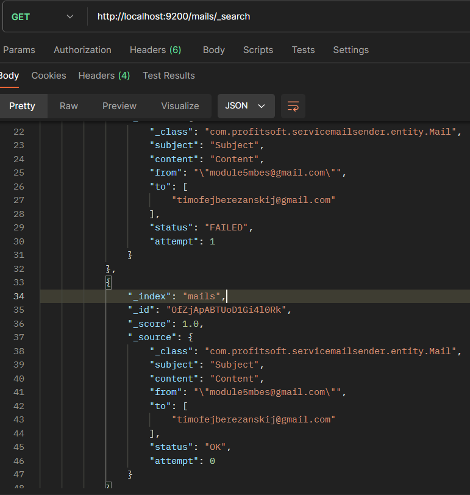

### Завдання до 5 модуля

Щоб запустити додаток вистачить клонувати репозиторій:
```git clone https://github.com/bereeza/profitsoft-esmb.git```

## Запуск
Після клонування репозиторія може виникнути проблема з pom.xml і треба явно вказати запуск програми. 
Для цього вистачить перейти в pom.xml і виконати цю дію:
-Add as maven project


Після цього можна запустити головний docker файл з сервісами. 
Я переніс файл налаштування postgres з 2 завдання в це, в головний докер файл. 
Тобто докер запускає consul, es, kibana, rabbitmq, postgres та song-service

```yml
services:
  consul:
  elasticsearch:
  kibana:
  rabbitmq:

  postgres:
  song-service:
#  mail-service:
```
При чому мені не вдалося зробити так, щоб запускався докер сервіс з відправкою, тому я закоментував його.
Я отримував ConnectionRefused. 

Якщо не вдалося запустити song-service: треба збілдити проект, та перезапустити контейнер. 


Для цього зберемо проект і отримаємо .jar:


Це є основні налаштування для проекту.

## Додатково

Приклад роботи з 2 випадками:



А також додавання пісні:

```http://localhost:1003/api/song```
```json
{
    "title": "Turning Away",
    "duration": 3.57,
    "album": "Order in Decline",
    "genre": "punk rock, alternative metal",
    "artist_id": 2
}
```

## Тести


